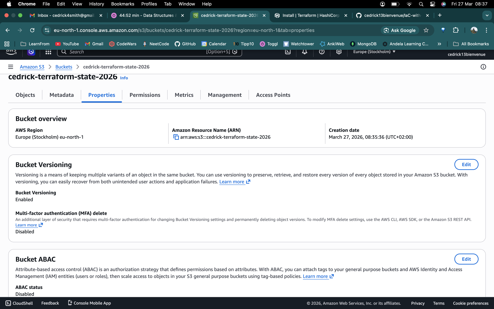
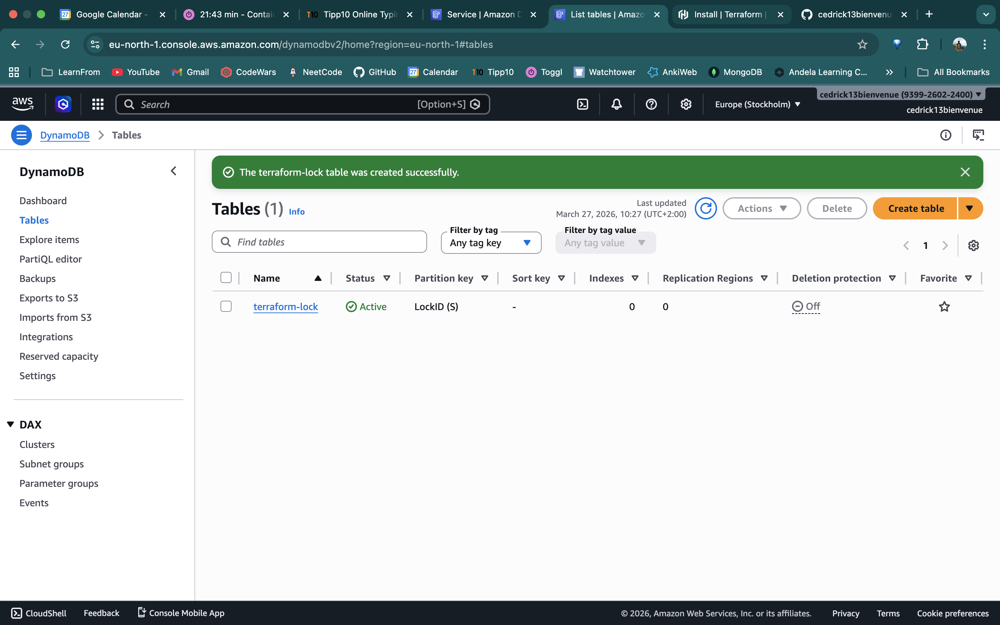
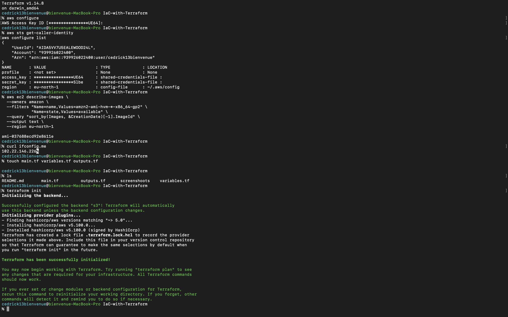
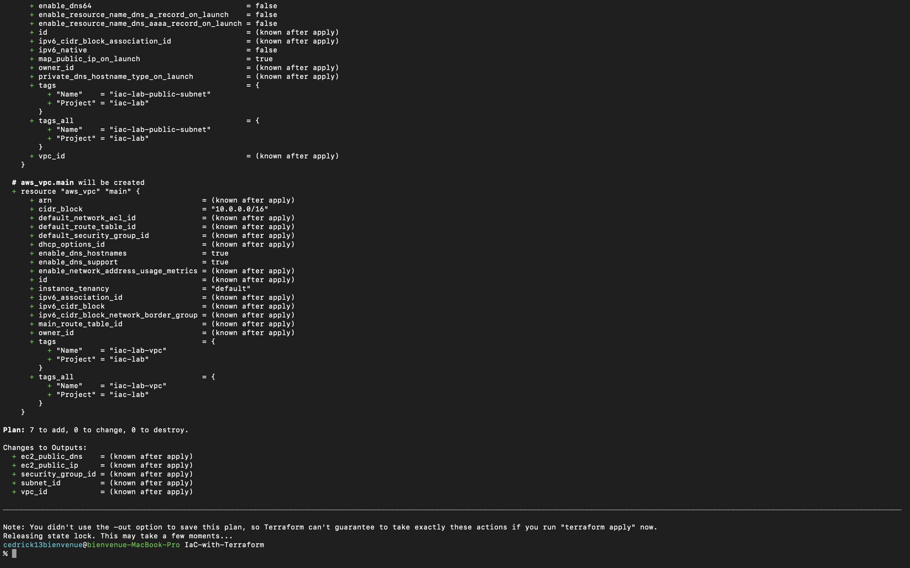
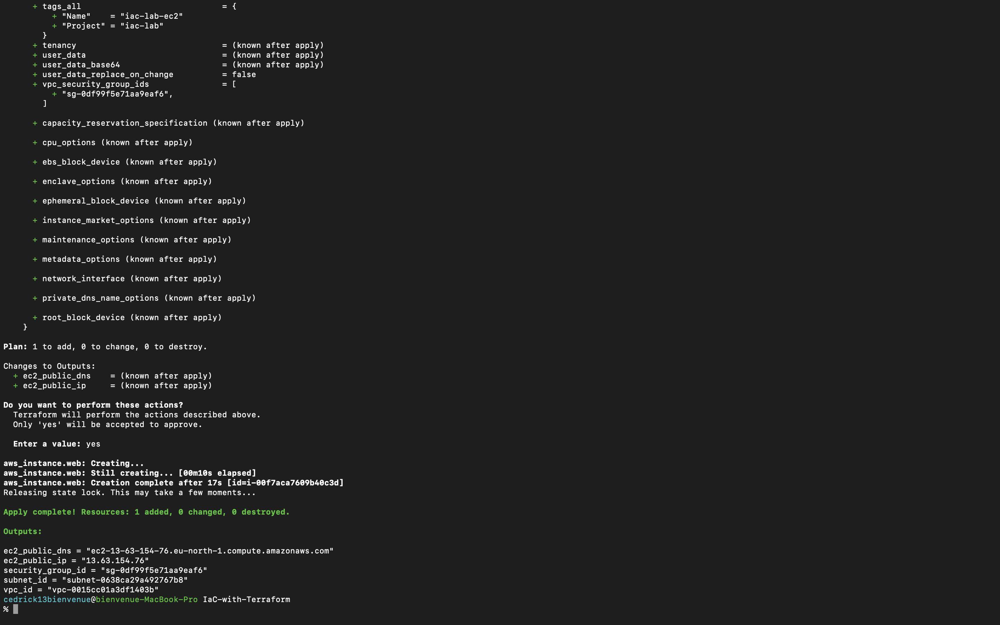
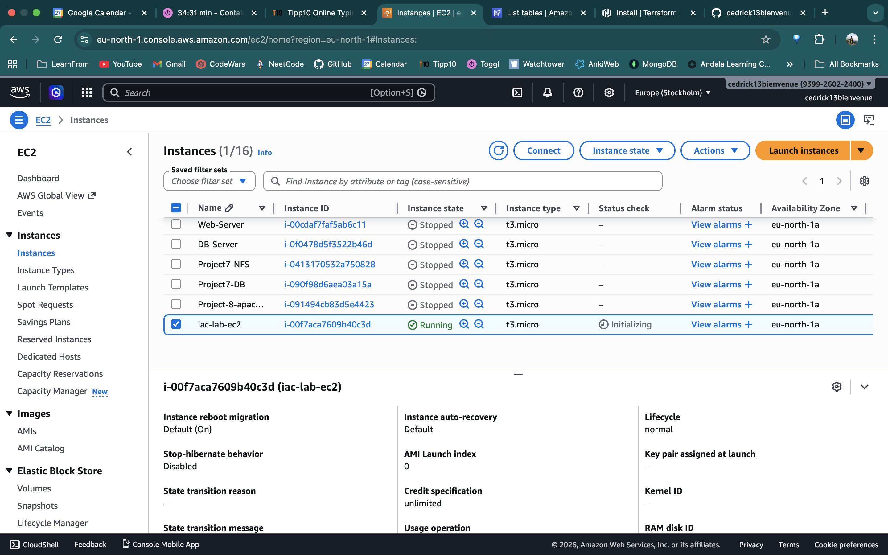
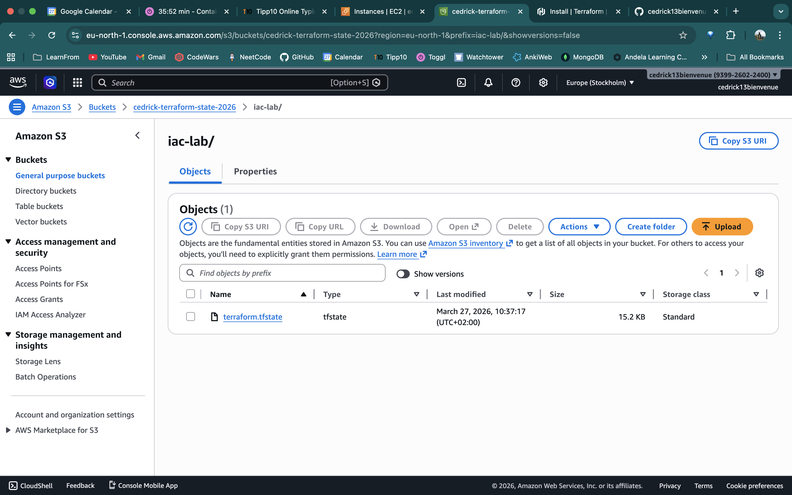
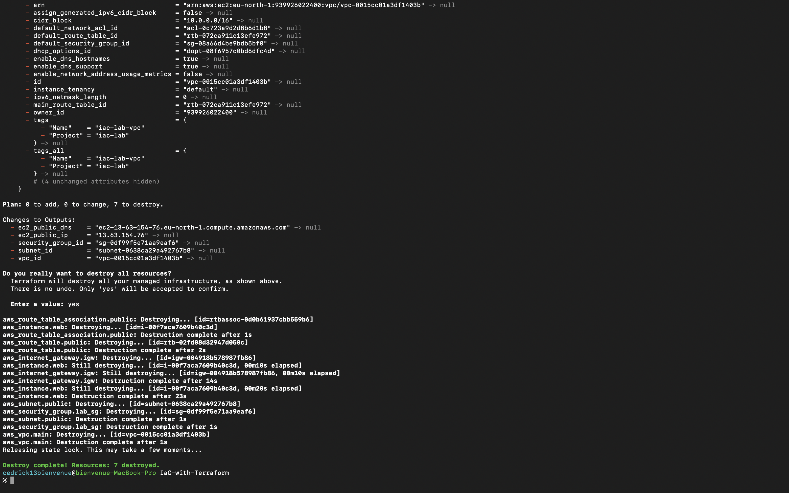

# IaC with Terraform — AWS Infrastructure Lab

## Overview

This lab demonstrates how to use **Terraform** to define, deploy, and destroy foundational AWS infrastructure using Infrastructure as Code (IaC) principles. It includes a remote backend configuration using Amazon S3 for state storage and DynamoDB for state locking.

---

## Objectives

- Install and configure Terraform with AWS credentials
- Define AWS infrastructure as code using `.tf` files
- Deploy: VPC, public subnet, Internet Gateway, Route Table, Security Group, and EC2
- Configure a remote backend: S3 bucket (state storage) + DynamoDB table (state locking)
- Run the full Terraform lifecycle: `init` → `plan` → `apply` → `destroy`

---

## Tools & Versions

| Tool      | Version    |
|-----------|------------|
| Terraform | v1.14.8    |
| AWS CLI   | v2.x       |
| Region    | eu-north-1 |
| OS        | macOS      |

---

## Project Structure

```
IaC-with-Terraform/
├── main.tf           # Core infrastructure + remote backend config
├── variables.tf      # Input variable definitions
├── outputs.tf        # Output values printed after apply
├── .gitignore        # Excludes state files and local Terraform dirs
├── README.md         # This file
└── screenshoots/     # Evidence screenshots
    ├── 01-s3-bucket-versioning-enabled.png
    ├── 02-dynamodb-lock-table.png
    ├── 03-terraform-init.png
    ├── 04-terraform-plan.png
    ├── 05-terraform-apply-complete.png
    ├── 06-ec2-instance-running.png
    ├── 07-s3-state-file.png
    └── 08-terraform-destroy-complete.png
```

---

## Infrastructure Diagram

```
                        ┌─────────────────────────────────┐
                        │           AWS VPC                │
                        │         10.0.0.0/16              │
                        │                                  │
                        │   ┌──────────────────────────┐   │
                        │   │      Public Subnet        │   │
                        │   │       10.0.1.0/24         │   │
                        │   │                           │   │
                        │   │  ┌────────────────────┐   │   │
                        │   │  │   EC2 (t3.micro)   │   │   │
                        │   │  │   Amazon Linux 2   │   │   │
                        │   │  │   SG: 22 (my IP)   │   │   │
                        │   │  │   SG: 80 (0.0.0.0) │   │   │
                        │   │  └────────────────────┘   │   │
                        │   └──────────────────────────┘   │
                        │              │                    │
                        │   ┌──────────▼───────────┐        │
                        │   │  Internet Gateway    │        │
                        │   └──────────────────────┘        │
                        └─────────────────────────────────┘
                                       │
                                   Internet
```

---

## Resources Deployed

| Resource         | Name                  | Details                              |
|------------------|-----------------------|--------------------------------------|
| VPC              | iac-lab-vpc           | CIDR: 10.0.0.0/16, DNS hostnames on  |
| Public Subnet    | iac-lab-public-subnet | CIDR: 10.0.1.0/24, eu-north-1a       |
| Internet Gateway | iac-lab-igw           | Attached to VPC                      |
| Route Table      | iac-lab-public-rt     | Route: 0.0.0.0/0 → IGW               |
| Security Group   | iac-lab-sg            | SSH (22) from my IP, HTTP (80) open  |
| EC2 Instance     | iac-lab-ec2           | t3.micro, Amazon Linux 2, free tier  |

---

## Remote Backend

Terraform state is stored remotely to enable collaboration and prevent data loss.

| Component      | Name                         | Purpose                           |
|----------------|------------------------------|-----------------------------------|
| S3 Bucket      | cedrick-terraform-state-2026 | Stores terraform.tfstate file     |
| DynamoDB Table | terraform-lock               | State locking (prevents conflicts)|

State file path in S3: `iac-lab/terraform.tfstate`

---

## Prerequisites

1. **Terraform** >= 1.5.0 installed
2. **AWS CLI** configured with valid credentials (`aws configure`)
3. S3 bucket created manually with versioning enabled
4. DynamoDB table created manually with `LockID` as partition key

---

## Usage

### 1. Initialize

```bash
terraform init
```

Downloads the AWS provider and connects to the S3 remote backend.

### 2. Plan (dry run)

```bash
terraform plan -var="my_ip=YOUR.IP.HERE/32"
```

Previews all resources that will be created. No changes are made.

### 3. Apply

```bash
terraform apply -var="my_ip=YOUR.IP.HERE/32"
```

Creates all infrastructure. Type `yes` to confirm.

### 4. Destroy

```bash
terraform destroy -var="my_ip=YOUR.IP.HERE/32"
```

Tears down all created resources. Type `yes` to confirm.

---

## Security Considerations

- SSH access (port 22) is restricted to a single IP (`/32`) — not open to the internet
- State file is encrypted at rest (`encrypt = true` in backend config)
- S3 bucket has public access blocked
- No credentials or secrets are stored in `.tf` files
- `.gitignore` excludes `*.tfstate`, `.terraform/`, and `*.tfvars`

---

## Screenshots

### 01 — S3 Bucket with Versioning Enabled


### 02 — DynamoDB Lock Table


### 03 — Terraform Init


### 04 — Terraform Plan


### 05 — Terraform Apply Complete


### 06 — EC2 Instance Running (AWS Console)


### 07 — S3 State File (Remote Backend Proof)


### 08 — Terraform Destroy Complete

